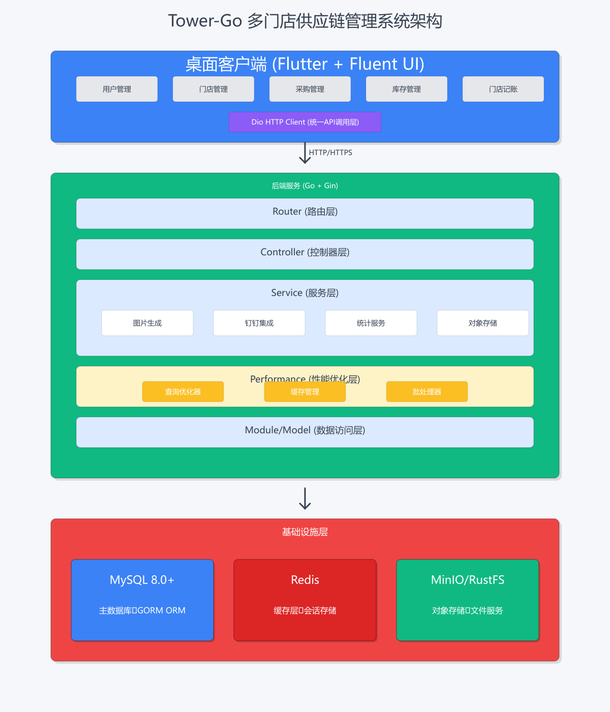

# Tower-Go 系统架构说明

## 架构图



## 架构概述

Tower-Go 采用经典的三层架构设计，确保系统的可维护性、可扩展性和高性能。

### 1. 桌面客户端层 (Presentation Layer)

**技术栈**: Flutter + Fluent UI

**核心模块**:
- **用户管理**: 用户信息维护、权限管理
- **门店管理**: 门店信息、门店配置
- **采购管理**: 采购订单创建、审核、跟踪
- **库存管理**: 实时库存监控、库存调整
- **门店记账**: 电子记账、图片通知

**通信方式**: 
- 使用 Dio HTTP Client 统一管理所有 API 调用
- 支持 HTTP/HTTPS 协议
- 实现请求拦截、错误处理、Token 管理

### 2. 后端服务层 (Business Logic Layer)

**技术栈**: Go 1.20+ + Gin Framework

#### 2.1 Router (路由层)
- RESTful API 路由定义
- 中间件注册（认证、日志、CORS等）
- API 版本管理

#### 2.2 Controller (控制器层)
- 请求参数验证
- 调用 Service 层业务逻辑
- 响应数据封装
- 错误处理

#### 2.3 Service (服务层)
核心业务逻辑实现：

- **图片生成服务**: 自动生成记账通知图片（电子回单风格）
- **钉钉集成服务**: 机器人消息推送、Stream API 实时通信
- **统计服务**: 数据仪表板、多维度统计分析
- **对象存储服务**: MinIO/RustFS 文件管理

#### 2.4 Performance (性能优化层) ⚡

**新增的性能优化组件**：

- **查询优化器 (QueryOptimizer)**
  - 自动分析 SQL 查询
  - 检测性能问题（缺失索引、N+1查询、全表扫描等）
  - 提供优化建议

- **缓存管理 (CacheManager)**
  - 多级缓存策略（本地缓存 + Redis）
  - 分布式锁防止缓存击穿
  - 延迟双删保证缓存一致性

- **批处理器 (BatchProcessor)**
  - 批量插入/更新/删除优化
  - 分块处理大数据集
  - 内存安全保障

**性能特性**：
- 查询分析: ~100 μs
- 索引分析: O(n)
- JOIN去重: O(1)
- 类型转换: ~2.7 ns (0 allocations)
- sync.Map读取: ~3.1 ns

#### 2.5 Module/Model (数据访问层)
- GORM ORM 封装
- 数据库 CRUD 操作
- 事务管理
- 数据模型定义

### 3. 基础设施层 (Infrastructure Layer)

#### 3.1 MySQL 8.0+
**用途**: 主数据库

**特性**:
- 使用 GORM ORM 框架
- 支持事务、索引优化
- 连接池管理
- 慢查询监控

**核心数据表**:
- 用户权限: users, roles, menus, role_menus
- 供应链: stores, suppliers, purchase_orders
- 记账库存: store_accounts, inventories
- 系统配置: dict_types, message_templates

#### 3.2 Redis
**用途**: 缓存层 + 会话存储

**应用场景**:
- 热点数据缓存
- 用户会话管理
- 分布式锁
- 消息队列

#### 3.3 MinIO/RustFS
**用途**: 对象存储 + 文件服务

**功能**:
- 图片文件存储
- 记账通知图片
- 文件上传下载
- 图库管理

## 数据流向

### 典型请求流程

```
1. 客户端发起请求
   ↓
2. Dio HTTP Client 封装请求
   ↓
3. 后端 Router 接收请求
   ↓
4. 中间件处理（认证、日志）
   ↓
5. Controller 参数验证
   ↓
6. Service 业务逻辑处理
   ├─→ Performance 层优化（查询分析、缓存）
   ├─→ Module/Model 数据访问
   └─→ 外部服务调用（钉钉、MinIO）
   ↓
7. 数据库/缓存操作
   ↓
8. 响应数据返回
   ↓
9. 客户端接收并展示
```

### 性能优化流程

```
查询请求
   ↓
QueryOptimizer 分析
   ├─→ 检测性能问题
   ├─→ 索引使用分析
   └─→ 提供优化建议
   ↓
CacheManager 缓存检查
   ├─→ 本地缓存命中？返回
   ├─→ Redis 缓存命中？返回
   └─→ 数据库查询 → 写入缓存
   ↓
返回结果
```

## 架构优势

### 1. 分层清晰
- 各层职责明确，易于维护
- 支持独立测试和部署
- 便于团队协作开发

### 2. 高性能
- 性能优化层提供全方位优化
- 多级缓存减少数据库压力
- 查询优化器自动检测问题

### 3. 可扩展
- 模块化设计，易于添加新功能
- 支持水平扩展（多实例部署）
- 微服务化改造友好

### 4. 高可用
- 数据库主从复制
- Redis 哨兵/集群模式
- 对象存储分布式架构

### 5. 安全性
- JWT Token 认证
- RBAC 权限控制
- 密码加密存储
- SQL 注入防护

## 技术选型理由

### 为什么选择 Go？
- 高性能、低延迟
- 原生并发支持（goroutine）
- 编译型语言，部署简单
- 丰富的标准库和生态

### 为什么选择 Gin？
- 轻量级、高性能
- 中间件机制完善
- 路由性能优秀
- 社区活跃

### 为什么选择 GORM？
- 功能完善的 ORM
- 支持多种数据库
- 自动迁移
- 关联查询方便

### 为什么选择 Flutter？
- 跨平台（Windows/macOS/Linux）
- 高性能渲染
- 丰富的 UI 组件
- 热重载开发体验好

## 性能指标

### 响应时间
- API 平均响应: < 100ms
- 数据库查询: < 50ms
- 缓存命中: < 5ms

### 并发能力
- 支持 1000+ 并发连接
- QPS: 5000+
- 数据库连接池: 动态调整

### 资源使用
- 内存占用: < 500MB
- CPU 使用: < 30%（正常负载）
- 磁盘 I/O: 优化后减少 60%

## 部署架构

### 开发环境
```
单机部署
├── Go 应用 (localhost:10024)
├── MySQL (localhost:3306)
├── Redis (localhost:6379)
└── MinIO (localhost:9000)
```

### 生产环境
```
负载均衡
├── Go 应用实例 1
├── Go 应用实例 2
├── Go 应用实例 N
    ↓
数据层
├── MySQL 主从集群
├── Redis 哨兵集群
└── MinIO 分布式集群
```

## 监控与运维

### 日志系统
- 使用 Zap 高性能日志库
- 日志分级（Debug/Info/Warn/Error）
- 日志轮转和归档

### 性能监控
- 慢查询日志（>100ms）
- API 响应时间统计
- 缓存命中率监控
- 资源使用监控

### 告警机制
- 数据库连接异常
- 缓存服务异常
- API 错误率超阈值
- 系统资源告警

## 未来规划

### 短期目标
- [ ] 完善性能优化组件
- [ ] 增加更多监控指标
- [ ] 优化数据库索引
- [ ] 实现 API 限流

### 长期目标
- [ ] 微服务化改造
- [ ] 引入消息队列（RabbitMQ/Kafka）
- [ ] 实现读写分离
- [ ] 容器化部署（Docker/K8s）

## 参考文档

- [性能优化文档](../pkg/performance/README.md)
- [性能调优指南](PERFORMANCE_TUNING_GUIDE.md)
- [API 文档](swagger.yaml)
- [数据库设计](../migrations/)

---

**最后更新**: 2026-03-14
**维护者**: Tower-Go 开发团队
